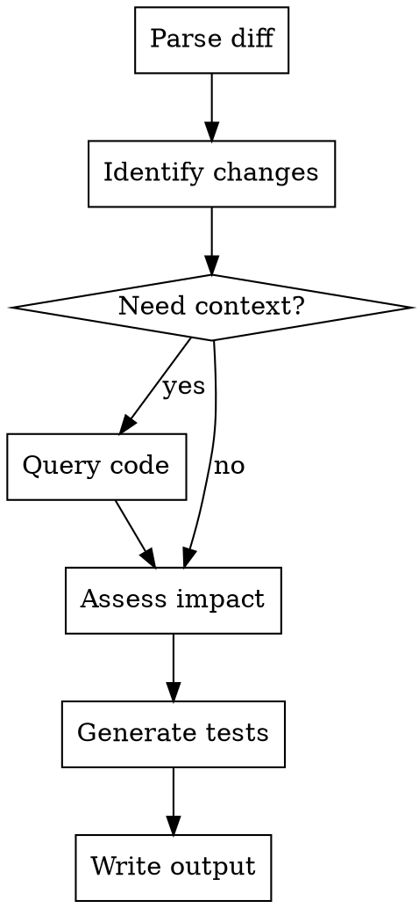

# Test Suggestion

## Overview

Generate test recommendations from git diff output, focusing on **BUSINESS IMPACT** not implementation details.

| Focus On | Ignore |
|----------|--------|
| User journeys affected | Helper functions changed |
| Business capabilities | Implementation algorithms |
| API contract changes | Refactoring patterns |
| Security risks | Code style |

## When to Use

- User provides git diff output (from `git --no-pager diff master` or `git --no-pager diff commitId1 commitId2`)
- User wants test recommendations written to a file

**Required:** git diff output, directory path, output file path

## Workflow



## Implementation

### Step 1: Parse Diff (FIRST)

**Do NOT analyze entire codebase first.** Start with diff parsing:

1. Parse git diff to identify changed files
2. Extract file paths and modification types
3. Group related changes into logical change points
4. Classify: feature / bugfix / refactor / config

**Query code only when needed:**
- Diff context insufficient
- Need function signatures or interfaces
- Need to verify dependencies

### Step 2: Analyze Changes

**Granularity Standard:**
- **Merge** small changes (single config value, version upgrade)
- **Split** large changes (entire module, multiple features)
- **Target**: One change point = One business capability

**Assess Business Impact:**
- User-facing impact (workflows, scenarios)
- Data impact (models, integrity)
- API impact (endpoints, contracts)
- Security impact (vulnerabilities, authorization)

### Step 3: Generate Test Recommendations

For each change point, generate 8-10 test scenarios covering:
- Happy path / Error scenarios
- Edge cases / Boundary conditions
- Concurrency / Performance
- Security / Data integrity

### Step 4: Output Format

Plain JSON array (no markdown code blocks):

```json
[
  {
    "id": "1",
    "codeModification": "代码改动点描述",
    "impact": "业务影响范围",
    "suggestion": ["测试建议1", "测试建议2", "测试建议3"]
  }
]
```

**Field Requirements:**
- `id`: Sequential number
- `codeModification`: What changed (business perspective)
- `impact`: Business impact (NOT implementation details)
- `suggestion`: Array of test scenarios (NOT unit tests for helpers)

## Example

**Input:** git diff with auth service token refresh changes

**Output:**
```json
[
  {
    "id": "1",
    "codeModification": "用户认证服务新增token刷新机制",
    "impact": "影响用户会话持续性和API访问安全性",
    "suggestion": ["token过期自动刷新机制验证", "刷新失败引导重新登录", "并发刷新只执行一次", "refresh接口参数响应验证", "连续1000次刷新响应时间<500ms", "过期token返回403防劫持", "刷新后旧token立即失效", "刷新操作日志记录"]
  },
  {
    "id": "2",
    "codeModification": "refresh_tokens表新增",
    "impact": "影响token刷新和用户登录状态管理",
    "suggestion": ["登录后token正确插入", "重复插入触发唯一约束", "刷新后记录更新", "登出后token删除", "过期记录自动清理", "多设备独立刷新", "外键约束验证", "查询性能<50ms@100万条"]
  }
]
```

## Common Mistakes

| Mistake | Fix |
|---------|-----|
| Over-querying codebase | Start with diff, query only when needed |
| Focusing on implementation | Focus on business impact |
| Too many/few test scenarios | Target 8-10 per change point |
| Unit tests for helpers | Test user journeys, API contracts |
| Missing API endpoints | List all changed endpoints |
| Invalid JSON | Ensure valid JSON syntax |
| Generic descriptions | Provide specific scenarios, metrics |

## Validation Checklist

- [ ] Diff parsed, all changed files identified
- [ ] Changes grouped with appropriate granularity
- [ ] Each change has business impact analysis
- [ ] Each change has 8-10 specific test scenarios
- [ ] Output is valid JSON array
- [ ] File written successfully